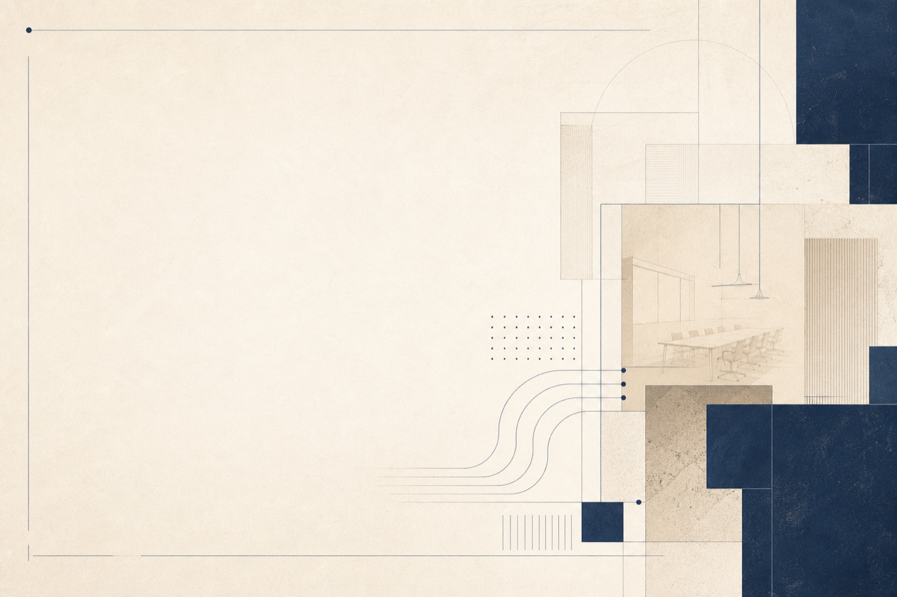

<div align="center">
  
</div>

<br />

<div align="center">
  
</div>

<p align="center">
  <a href="https://github.com/Shahidhamid"></a>
  <a href="mailto:shahid.hamiid@gmail.com"></a>
</p>

---

I design and ship full-stack systems with a bias toward clarity — products that feel calm under pressure, and data paths that stay understandable months later.

At **Bright Query**, I work on collaborative workshop software (Quorum): facilitator flows, participant experiences, and the architecture underneath.

### What I care about

| | |
|:--|:--|
| **Product engineering** | TypeScript, React, Node — interfaces that respect attention |
| **Data systems** | ETL, warehousing, pipelines that turn signal into decisions |
| **Craft** | Clean architecture, performance, documentation that ages well |

### Stack

<p align="center">
  
</p>

### Selected focus

```
→ Workshop & facilitation product surfaces
→ Full-stack systems with durable boundaries
→ Data pipelines that stay operable
→ Performance and maintainability as defaults
```

### Activity

<p align="center">
  
  
</p>

---

<p align="center">
  
</p>

<p align="center">
  <sub>Open to thoughtful collaborations — <a href="mailto:shahid.hamiid@gmail.com">shahid.hamiid@gmail.com</a></sub>
</p>

<p align="center">
  <em>Simplicity is the ultimate sophistication.</em>
</p>
