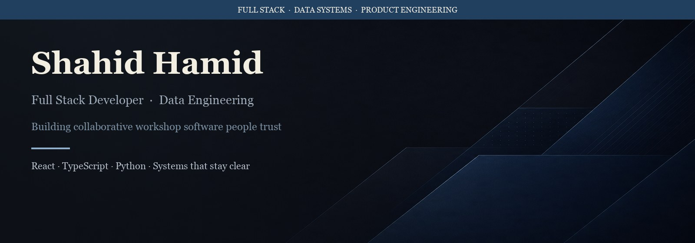

  

 

**Shahid Hamid**  
Full Stack Developer · Data Systems · Product Engineering

  
  

---

## About

I am a full stack developer focused on building reliable, maintainable software across the product and data layers. My work spans collaborative workshop platforms—facilitator workflows, participant experiences, and the systems that support them—and data pipelines that turn raw inputs into actionable insight.

I prioritize clear architecture, thoughtful interfaces, and documentation that remains useful as systems evolve.

---

## Expertise

| Area | Focus |
|------|-------|
| **Product engineering** | TypeScript, React, and Node.js applications with attention to usability and performance |
| **Data systems** | ETL pipelines, warehousing, and tooling that support reliable reporting and decision-making |
| **Engineering practice** | Modular design, operational clarity, and long-term maintainability |

---

## Technology

  

---

## Current Focus

- Workshop and facilitation product development
- Full-stack systems with well-defined service boundaries
- Data pipelines designed for observability and ease of operation
- Performance optimization and sustainable code quality

---

## GitHub Activity

  
  

 

  
  

---

  Open to collaboration and consulting opportunities — <a href="mailto:shahid.hamiid@gmail.com">shahid.hamiid@gmail.com</a>

