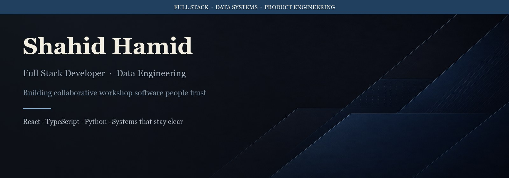

<!-- Profile README — dark-mode first, absolute asset URLs -->

<div align="center">
  
</div>

<br/>

<div align="center">
  
</div>

<p align="center">
  <a href="https://github.com/Shahidhamid"></a>
  <a href="mailto:shahid.hamiid@gmail.com"></a>
</p>

---

### About

I design and ship full-stack systems with a bias toward clarity — products that feel calm under pressure, and data paths that stay understandable months later.

I build collaborative workshop software: facilitator flows, participant experiences, and the architecture underneath.

---

### Focus

```text
Product engineering   →  TypeScript · React · Node — interfaces that respect attention
Data systems          →  ETL · warehousing · pipelines that turn signal into decisions
Craft                 →  Clean architecture · performance · docs that age well
```

---

### Stack

<div align="center">
  
</div>

---

### Now

- Workshop & facilitation product surfaces  
- Full-stack systems with durable boundaries  
- Data pipelines that stay operable  
- Performance and maintainability as defaults  

---

### Activity

<div align="center">
  
  
</div>

<br/>

<div align="center">
  
  
</div>

---

<p align="center">
  Open to thoughtful collaborations — <a href="mailto:shahid.hamiid@gmail.com">shahid.hamiid@gmail.com</a>
</p>

<p align="center">
  <em>Simplicity is the ultimate sophistication.</em>
</p>
